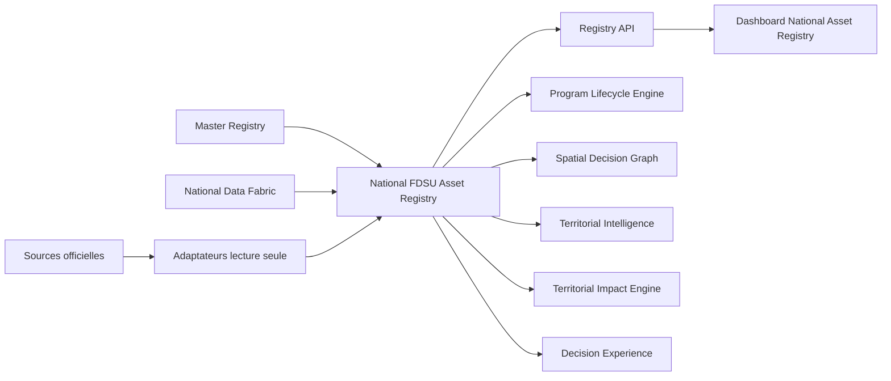
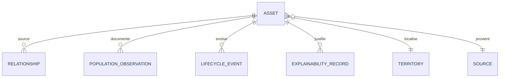
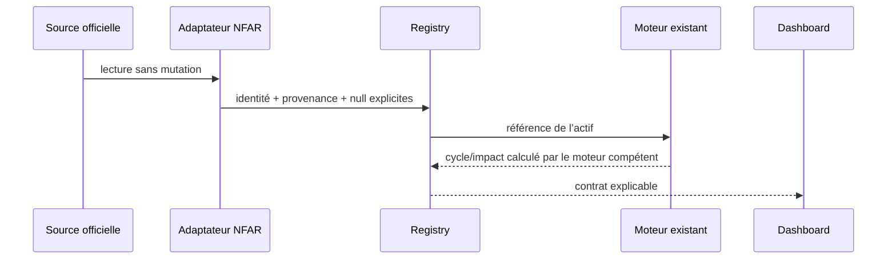

# National FDSU Asset Registry v1.0

## 1. Objet et portée

Le National FDSU Asset Registry (NFAR) est la couche métier fédérée d’identité, de localisation, de gouvernance et d’explicabilité des actifs du Service universel. Il ne remplace ni les documents officiels, ni le Master Registry, ni le National Data Fabric (NDF). Les fichiers de `data/raw/`, `data/strategic/` et `data/business/` restent les Sources de Vérité.

Principes opposables : **Data First**, absence de valeur inventée, identité stable, provenance obligatoire, règles métier référencées plutôt que dupliquées, compatibilité progressive avec les moteurs existants.

## 2. Positionnement architectural

Le Master Registry conserve l’identité canonique et la validation des codes. Le NDF catalogue les référentiels, leur qualité et leurs relations. Le NFAR présente une vue d’actif directement consommable, sans créer une base parallèle.

## 3. Modèle d’actif

Chaque actif expose : UUID déterministe interne, code métier, programme, type et sous-type, source, version, date d’intégration, producteur, confiance, état des données et référence brute. L’identité territoriale comprend zone FDSU, province, territoire, secteur, chefferie, collectivité, groupement, localité, village, latitude, longitude et altitude lorsqu’elle existe.

Les types préparés sont : sites FDSU, CCN, télécommunications, santé, éducation, énergie, routes, services publics, population, localités, corridors économiques et zones prioritaires. Un type sans référentiel disponible porte l’état `unavailable` et un compteur `null`, jamais zéro fictif.

## 4. Programmes et sources v1

| Programme | Source chargée | Classe de données | Volume attendu du Registry |
|---|---|---|---:|
| Sites 40 | `data/programs/sites_40/sites_40.json` | réel | 40 |
| Sites 300 | `data/programs/sites_300/sites_300.json` et matrice officielle | réel | 300 |
| Sites 20 476 | `data/programs/sites_20476/sites_20476.json` | réel | 20 476 |
| CCN | `data/programs/ccn/demo_ccn.json` | démonstration à valider | selon source |

Les populations existantes sont reprises telles quelles. Population couverte, non couverte, ménages et couverture nationale restent `null` tant qu’aucune source ou méthode officielle ne les documente.

## 5. Relations et graphe national

La v1 publie uniquement les rattachements territoriaux explicitement présents dans la source (`LOCATED_IN`). Les relations calculées de proximité — population, santé, écoles, opérateurs, routes, fibre, marchés, services publics, autres sites et CCN — restent sous la responsabilité du National Spatial Matching Engine et du Spatial Decision Graph. Chaque relation expose type, cible, source et explication.

## 6. Cycle de vie

Le Registry délègue au Program Lifecycle Engine. Les dimensions `data_status`, `program_status`, `asset_status`, `worksite_status`, `service_status` et `impact_status` restent séparées. Aucun actif n’est déclaré opérationnel à partir du seul fait que sa donnée est intégrée. L’historique détaillé constitue un contrat préparé pour la v2.

## 7. Priorisation FDSU et préparation CCN

Le bloc `fdsu_decision` référence le Decision Engine et la matrice officielle : priorité, classe S1/S2/S3/S4, score, critères, justification et documents peuvent être exposés lorsqu’ils existent. Le Registry ne recalcule aucune pondération.

Le bloc `ccn_readiness` prépare candidat, raison, type proposé, services attendus, score et justification. Pour les sites ordinaires, ces valeurs restent `null` avec l’état `structure_prepared_no_ccn_engine`. Aucun moteur CCN nouveau n’est implémenté en v1.

## 8. Asset Explainability Layer

Chaque champ peut répondre à : pourquoi la valeur est affichée, quelle source et quelle version, quel moteur, quel document, quelle règle et quel calcul. La règle par défaut est la conservation de `null` en l’absence de donnée documentée. L’API `/explainability` expose ce contrat.

## 9. API

| Route | Responsabilité |
|---|---|
| `GET /registry/manifest` | capacités, types et principes |
| `GET /registry/statistics` | agrégats réels et maturité |
| `GET /registry/assets` | liste filtrée et paginée |
| `GET /registry/assets/{id}` | fiche canonique |
| `GET /registry/assets/{id}/relationships` | relations documentées |
| `GET /registry/assets/{id}/population` | observations populationnelles |
| `GET /registry/assets/{id}/lifecycle` | profil PLE |
| `GET /registry/assets/{id}/impact` | délégation Territorial Impact |
| `GET /registry/assets/{id}/explainability` | provenance et règle |

## 10. Flux de données et gouvernance

Chaque valeur expose source, version, date, qualité ou état, confiance, producteur et traçabilité. Les données de démonstration restent étiquetées. Les adaptateurs ne corrigent pas silencieusement les anomalies des sources.

## 11. Compatibilité et migration progressive

La v1 est additive. Aucun endpoint historique n’est supprimé. SDG, Territorial Intelligence, Territorial Impact, Program Lifecycle et Decision Experience peuvent migrer par adaptateur, actif par actif. La règle de bascule est : même identité, même source, mêmes résultats métier, puis remplacement du lecteur historique. Un moteur ne doit jamais dépendre de la présentation dashboard.

## 12. Validation

Les tests backend vérifient les volumes 40, 300 et 20 476, les CCN explicitement démonstratifs, l’identité, la localisation, la population, les relations, le cycle de vie, l’API et l’explicabilité. Playwright vérifie l’API, les agrégats, la vue, la provenance et le filtrage sans valeurs techniques indésirables.

## 13. Roadmap v2

1. Brancher les identités NFAR dans le SDG sans modifier son résultat métier.
2. Ajouter des adaptateurs sectoriels paginés pour télécom, santé, routes, population et localités.
3. Matérialiser le graphe national explicable et ses versions.
4. Ajouter l’historique d’actif et la gestion des fusions avec le Master Registry.
5. Consolider les observations populationnelles avec dates et emprises.
6. Préparer le moteur CCN après validation officielle de ses critères.
7. Ajouter une persistance PostGIS versionnée après validation du modèle logique.
