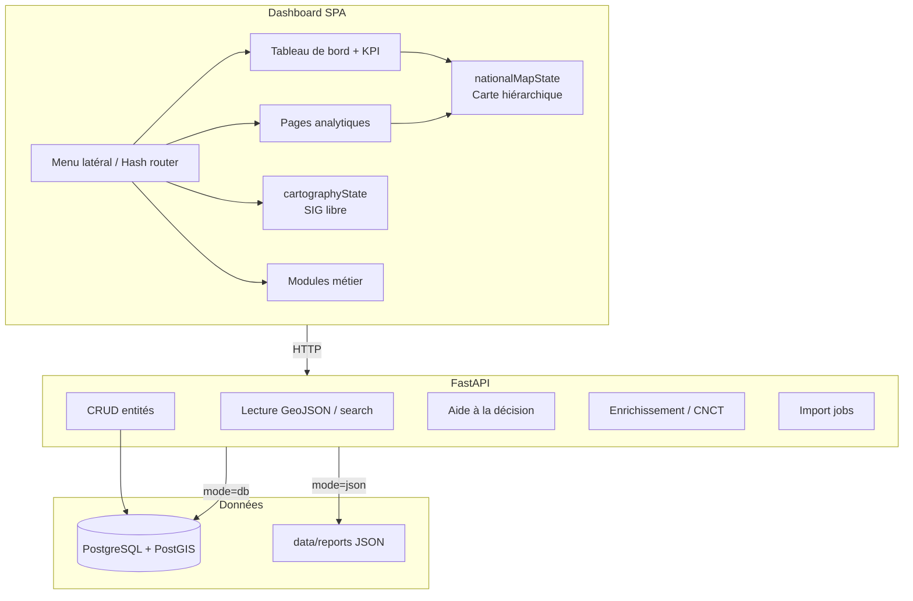

# SIG-FDSU RDC — Architecture fonctionnelle v1.0

**Sprint 9.0 — Conception fonctionnelle**  
**Date :** 7 juillet 2026  
**Statut :** Document de référence (sans développement)  
**Branche de référence :** `feature/smart-map-interactions`

---

## Contexte et objectif du document

Ce document définit l’architecture fonctionnelle cible du SIG-FDSU RDC avant la poursuite des développements vers la version 1.0 opérationnelle. Il consolide l’état réel du code (Sprints 3.x à 8.3), les documents existants (`docs/ARCHITECTURE_FONCTIONNELLE_v1.0.md`, `docs/MASTER_DATA_MODEL_v1.0.md`, `docs/SCHEMA_DIRECTEUR_SIG_FDSU_v1.0.md`) et la vision métier FDSU.

**Règle Sprint 9.0 :** aucune nouvelle fonctionnalité n’est développée dans ce sprint ; seule la conception est produite.

### État actuel du produit (juillet 2026)

| Domaine | Maturité | Référence |
|---------|----------|-----------|
| Tableau de bord national + KPI | ✅ Opérationnel | Sprint 8.3 |
| Carte nationale hiérarchique | ✅ Opérationnel | Sprint 8.1 / 8.2 |
| Cartographie libre multi-couches | ✅ Opérationnel | Sprint 8.2 |
| Pages analytiques KPI (listes + cartes) | ✅ Opérationnel | Sprint 8.3 |
| Référentiel administratif | ✅ Partiel | Sprint 3.1 |
| Aide à la décision | ✅ Partiel | Sprint 3.x |
| CNCT / Enrichissement territorial | ✅ Socle | Sprint 3.2–3.4 |
| Fiches entités complètes | 🟡 À concevoir / implémenter | v0.8 |
| Missions + documents persistants | 🟡 CRUD API, UI partielle | v0.9 |
| Authentification / rôles | 🔴 Non implémenté | v1.0 |
| Import / Export | 🟡 Prototype UI + API | v0.9 |
| Rapports institutionnels | 🟡 JSON reports + exports partiels | v1.0 |

**Tests automatisés :** 21 scénarios Playwright passants (`tests/e2e/smart-map.spec.js`).

---

## 1. Vision générale du SIG-FDSU RDC

### 1.1 Objectif du logiciel

Le SIG-FDSU RDC est une **plateforme nationale d’information géographique et d’aide à la décision** destinée au Fonds de Développement du Service Universel en République Démocratique du Congo.

Il doit permettre de :

- structurer et maintenir le **référentiel administratif national** (Zones FDSU → localités) ;
- inventorier, codifier et suivre les **sites FDSU** et les **Centres Communautaires Numériques (CCN)** ;
- planifier, documenter et tracer les **missions terrain** ;
- analyser la **connectivité**, les **services publics** et le **potentiel économique** territorial ;
- **prioriser les investissements** numériques sur des critères explicites et traçables ;
- produire des **rapports et exports** fiables pour la Direction, les partenaires et le terrain.

Le logiciel dépasse la logique d’un simple visualiseur cartographique : c’est un **outil métier institutionnel** reliant référentiel, cartographie, profils territoriaux, opérations terrain et décision.

### 1.2 Utilisateurs cibles

| Profil | Besoin principal |
|--------|------------------|
| **Directeur / décideur FDSU** | Vision nationale, KPI, priorités, rapports stratégiques |
| **Géomaticien / analyste SIG** | Cartographie libre, couches, exports géo, qualité des données |
| **Technicien terrain** | Missions, photos, documents, saisie et validation locale |
| **Superviseur opérationnel** | Suivi par zone/province, listes filtrées, fiches entités |
| **Administrateur système** | Utilisateurs, paramètres, imports, gouvernance des référentiels |
| **Partenaire technique / financier** | Consultation, rapports, exports (accès restreint en v1.0) |

### 1.3 Problèmes à résoudre

- **Dispersion des données** : fichiers Excel, KML, rapports locaux non centralisés.
- **Absence de référentiel unique** : incohérences entre provinces, territoires, collectivités, groupements et localités.
- **Faible traçabilité** : décisions d’implantation de sites ou CCN peu documentées.
- **Analyse manuelle** : croisement population / connectivité / services publics fait hors système.
- **Double usage cartographique confondu** : besoin d’un **cockpit décisionnel** (navigation hiérarchique) distinct d’un **atelier SIG** (superposition libre des couches).

### 1.4 Valeur ajoutée pour le FDSU

- **Une source de vérité territoriale** alignée sur la nomenclature FDSU (5 zones : ND, OT, CE, SD, ET).
- **Décisions argumentées** via scores, filtres métier et justification des priorités.
- **Gain de temps** : compteurs → listes → fiches → exports en un parcours unique.
- **Preuve et audit** : missions, documents, photos, historique d’import et de modification.
- **Continuité démo / production** : mode `json-reports` pour démonstration ; mode PostgreSQL/PostGIS pour exploitation nationale.

### 1.5 Principes directeurs

1. **Ne jamais inventer une donnée** — afficher « donnée à compléter » si absent.
2. **Un compteur ouvre une liste**, jamais directement une fiche unique.
3. **Hiérarchie territoriale respectée** — Zone → Province → Territoire → Collectivité → Groupement → Localité → Site → Mission.
4. **Deux cartes, deux rôles** — cockpit national vs atelier SIG (cf. section 4).
5. **PostgreSQL/PostGIS = source principale** ; JSON = secours et échange.
6. **Traçabilité** — source, qualité, historique sur toute entité sensible.

---

## 2. Modules principaux

Le dashboard (`dashboard/index.html`, `dashboard/app.js`) expose **14 modules** via un menu latéral et un routage par hash (`#dashboard`, `#map`, etc.).

Légende de maturité : ✅ implémenté · 🟡 partiel · 🔴 planifié v1.0

### 2.1 Tableau de bord national ✅

**Rôle :** Point d’entrée décisionnel — synthèse nationale, KPI, carte hiérarchique.

**Contenu :**
- Bandeau KPI cliquable (Zones, Provinces, Territoires, Collectivités, Groupements, Localités, Sites, Missions, Utilisateurs).
- Carte nationale hiérarchique (`#dashboard-national-map`, état `nationalMapState`).
- Accès rapide aux pages analytiques et à la recherche globale.

**État actuel :** Sprint 8.3 — pages analytiques dédiées ; workbench superposé supprimé.

### 2.2 Cartographie libre ✅

**Rôle :** Atelier SIG professionnel — exploration multi-couches sans contrainte hiérarchique.

**Contenu :**
- Instance Leaflet indépendante (`#map`, état `cartographyState`).
- Empilement libre des couches (zones FDSU, provinces, territoires, collectivités, groupements, localités, sites, missions).
- Modes thématiques (`FDSU_SMART_MAP_MODES`) : administratif, connectivité, économique, priorité CCN, qualité des données, décision.
- Liste synchronisée carte/tableau, popups, panneau latéral attributaire.

**État actuel :** Sprint 8.2 — filtrage hiérarchique exclusif retiré de ce module.

### 2.3 Zones FDSU ✅ / 🟡

**Rôle :** Premier niveau de lecture métier FDSU (ND, OT, CE, SD, ET).

**Contenu cible :**
- 5 zones avec code, nom, couleur officielle, provinces rattachées.
- Statistiques agrégées (population, sites, missions, connectivité).
- Page analytique dédiée (`dashboardViewState.detailType = 'zones'`).

**État actuel :** KPI + page analytique ; couche zones en cartographie libre ; pas encore de fiche Zone complète.

### 2.4 Provinces ✅ / 🟡

**Rôle :** Niveau administratif national (26 provinces), rattachées à une Zone FDSU.

**Contenu cible :** Liste, carte, filtres, fiche avec territoires enfants, profils, connectivité, exports.

**État actuel :** Page analytique + drill-down carte nationale ; fiche riche à implémenter (v0.8).

### 2.5 Territoires ✅ / 🟡

**Rôle :** Subdivisions provinciales — pivot administratif majeur.

**Contenu cible :** Carte, collectivités/groupements/localités enfants, statistiques, score FDSU agrégé.

**État actuel :** API + pages analytiques ; géométries parfois attributaires seules en mode JSON.

### 2.6 Collectivités ✅ / 🟡

**Rôle :** Secteurs, chefferies, cités selon `CollectiviteType`.

**Contenu cible :** Filtres province/territoire, carte, groupements et localités associés.

### 2.7 Groupements ✅ / 🟡

**Rôle :** Subdivision sous collectivité ; référentiel officiel enrichi (Sprint groupements).

**Contenu cible :** Points/polygones, localités enfants, profils, missions.

### 2.8 Localités ✅ / 🟡

**Rôle :** **Fiche opérationnelle la plus critique** pour la priorisation CCN et FDSU.

**Contenu cible :** Population, services, connectivité, score FDSU, justification, recommandation.

**État actuel :** Page analytique ; couche API `localites` / `villages` ; fiche complète planifiée v0.8.

### 2.9 Sites FDSU 🟡

**Rôle :** Inventaire des infrastructures planifiées, en construction, actives ou à renforcer.

**Contenu cible :**
- Codification automatique : `FDSU_<ZONE>_<PROVINCE>_<TERRITOIRE>_<COLLECTIVITE>_<NUM>`.
- Type, statut, technologie, capacité, opérateur, historique (`SiteLifecycle`).
- Module dédié `#sites-panel` (placeholder UI) + page analytique dashboard.

**État actuel :** CRUD API `/sites` ; données clairsemées en mode JSON ; module UI à finaliser.

### 2.10 Missions terrain 🟡

**Rôle :** Planification, exécution, clôture des interventions terrain.

**Contenu cible :** Objectif, zone/entité/site associé, statut, dates, équipe, compte rendu, documents, photos.

**État actuel :** CRUD API `/missions`, `/documents`, `/photos` ; page analytique dashboard ; pas de module missions autonome complet.

### 2.11 Documents / photos 🟡

**Rôle :** Preuves et pièces jointes rattachées aux missions (extension future : fiches territoriales via CNCT).

**Contenu cible :** Upload, typologie, métadonnées, aperçu, lien mission/entité, export.

**État actuel :** Modèles SQLAlchemy + routes CRUD ; UI dashboard limitée.

### 2.12 Import / export 🟡

**Rôle :** Intégration contrôlée et restitution des données.

**Import :**
- Formats : Excel, CSV, JSON, GeoJSON, KML, Shapefile.
- API : `POST /imports/preview`, `POST /imports/start`, suivi job.
- Dashboard : prévisualisation client (SheetJS), rapport d’anomalies.
- CLI : `scripts/import_fdsu.py`, `import_all_referentiel.py`.

**Export :**
- Dashboard : couches + formats (CSV, JSON, GeoJSON, Excel, KML).
- Module décision : export CSV/JSON des priorités.
- Cible v1.0 : KMZ natif, PDF serveur, streaming gros volumes.

### 2.13 Administration / utilisateurs 🔴

**Rôle :** Comptes, rôles, permissions, journal d’activité.

**État actuel :** Module `#utilisateurs-panel` marqué « Bientôt » ; profil statique « Administrateur » ; aucune authentification.

**Cible v1.0 :** RBAC minimal (Directeur, Analyste, Terrain, Admin).

### 2.14 Paramètres 🔴

**Rôle :** Configuration système — mode données, nomenclatures, pondérations score FDSU, sources, URL API.

**État actuel :** Placeholder UI ; configuration via `.env` et `dashboard/app.js` (`DATA_MODE`).

### 2.15 Rapports 🟡

**Rôle :** Synthèses décisionnelles institutionnelles.

**Contenu cible :**
- Rapports JSON générés (`data/reports/`) : compteurs nationaux, audits référentiels.
- Exports décisionnels (localités prioritaires, territoires à fort potentiel).
- CNCT : audit documentaire (`/knowledge/documentary/*`).
- Cible v1.0 : génération PDF, modèles institutionnels, planification.

### 2.16 Modules transverses (existants, hors liste minimale)

| Module | Rôle |
|--------|------|
| **Référentiel administratif** | Listes, recherche, consultation hiérarchique |
| **Gestion des référentiels** | Gouvernance, validation, publication, qualité |
| **Explorateur de sources** | Inspection des sources brutes et rapports |
| **Aide à la décision** | Filtres métier, scores, cartes et exports priorités |
| **Centre de connaissances (CNCT)** | Fiches encyclopédiques territoriales |
| **Enrichissement territorial** | Suggestions, validation, traçabilité |

---

## 3. Navigation globale

### 3.1 Menu latéral

Navigation principale par **14 entrées** (`moduleNames` dans `app.js`) :

```
Tableau de bord
Cartographie
Référentiel administratif
Gestion des Référentiels
Explorateur de Sources
Sites FDSU
Aide à la décision
Centre de connaissances
Enrichissement territorial
Import | Export | Statistiques | Utilisateurs | Paramètres
```

**Comportement :**
- Routage hash : `#dashboard`, `#map`, `#referentiel`, `#registry`, `#sources`, `#sites`, `#decision`, `#knowledge`, `#enrichment`, etc.
- Fonctions : `navigateTo()`, `setActiveModule()`, `renderRouteFromHash()`.
- Titre de page et contexte mis à jour dans la barre supérieure.

### 3.2 Tableau de bord principal

Vue `#dashboard-main-view` :

1. Grille KPI (9 indicateurs).
2. Carte nationale hiérarchique sous les KPI.
3. Fil d’Ariane carte : `#dashboard-map-breadcrumb`.
4. Liste synchronisée : `#dashboard-map-synchronized-list`.

**Règle :** les KPI ouvrent des **pages analytiques pleine page**, pas un panneau superposé.

### 3.3 Pages analytiques

Vue `#dashboard-detail-view`, état `dashboardViewState` :

```javascript
dashboardViewState = {
  page: 'main' | 'detail',
  detailType: 'zones' | 'provinces' | 'territories' | 'collectivities'
           | 'groupements' | 'localities' | 'sites' | 'missions',
  selectedEntityId, selectedZoneCode, filters, rows, features, map
}
```

**Chaque page analytique contient :**
- Bouton « Retour au tableau de bord »
- Carte Leaflet `#dashboard-detail-map`
- Liste interactive `#dashboard-detail-list`
- Panneau statistiques `#dashboard-detail-stats`
- Recherche et filtres (province, territoire selon le niveau)

**Configuration :** `DASHBOARD_DETAIL_PAGE_CONFIG`, ouverture via `openDashboardDetailPage()`.

### 3.4 Fiches d’entités (cible v0.8)

Parcours cible :

```
Compteur KPI → Page analytique (liste + carte)
  → Clic ligne ou entité carte → Fiche entité (panneau ou vue dédiée)
    → Onglets : Identité | Hiérarchie | Stats | Connectivité | Documents | Missions | Export
```

**État actuel :** pages analytiques avec stats contextuelles ; fiches multi-onglets complètes **non encore implémentées**.

API prête : `GET /entities/{layer}/{entity_id}` retourne détail + statistiques enfants.

### 3.5 Retour au contexte précédent

| Contexte | Mécanisme |
|----------|-----------|
| Page analytique | Bouton « Retour au tableau de bord » → `dashboardViewState.page = 'main'` |
| Carte nationale | `goBackNationalContext()` — remonte d’un niveau hiérarchique |
| Carte nationale | `resetDashboardNationalView()` — retour vue RDC |
| Cartographie libre | `resetMapToNationalView()` — recentrage RDC (sans drill-down) |
| Fiche entité (cible) | Fil d’Ariane + bouton Retour vers liste filtrée d’origine |

### 3.6 Fil d’Ariane

**Carte nationale dashboard :**
- `#dashboard-map-breadcrumb` — segments cliquables (RDC → Province → …).
- État : `nationalMapState.spatialContext` + `nationalMapState.spatialContextTrail`.

**Pages analytiques / fiches (cible) :**
- `Tableau de bord > Provinces > Nord-Kivu > Territoire X > …`

**Règle :** chaque segment restaure le contexte cartographique et les filtres de liste correspondants.

### 3.7 Recherche globale

**Endpoint :** `GET /entities/search?q=…`

**Comportement cible :**
- Autocomplétion multi-couches (provinces, territoires, localités, sites…).
- Sélection → zoom carte + ouverture fiche ou page analytique filtrée.
- Raccourcis zones FDSU depuis le dashboard.

**État actuel :** recherche globale opérationnelle en UI ; synchronisation carte/tableau post-recherche partiellement finalisée (backlog Sprint 3.2).

---

## 4. Logique cartographique

### 4.1 Principe fondamental : deux cartes, deux missions

| | **Carte nationale (dashboard)** | **Module Cartographie (SIG libre)** |
|---|--------------------------------|-------------------------------------|
| **Métaphore** | Cockpit décisionnel | Atelier SIG |
| **Instance Leaflet** | `#dashboard-national-map` | `#map` |
| **État JS** | `nationalMapState` | `cartographyState` |
| **Initialisation** | `initializeNationalMapModule()` | `initializeCartographyModule()` |
| **Navigation** | Drill-down **exclusif** hiérarchique | Superposition **libre** des couches cochées |
| **Contexte spatial** | `spatialContext` + `spatialContextTrail` | Contexte local pour sélection, sans exclusivité |
| **Couches** | Provinces → territoires → collectivités → groupements → localités → sites | + Zones FDSU, thématiques, placeholders villes/communes |
| **Liste associée** | `#dashboard-map-synchronized-list` | Liste synchronisée cartographie |
| **Retour** | `goBackNationalContext()` / `resetDashboardNationalView()` | `resetMapToNationalView()` (recentrage RDC) |

### 4.2 Carte nationale — cockpit hiérarchique

**Flux de navigation exclusive :**

```
RDC (contour national rdcBoundary)
  → clic province → affiche UNIQUEMENT cette province + ses territoires
    → clic territoire → collectivités
      → clic collectivité → groupements
        → clic groupement → localités
          → clic localité → sites
            → message si aucune subdivision
```

**Fonctions clés :**
- `renderNationalContextMap()` — rendu contexte + enfants
- `activateNationalSpatialContext()` — activation drill-down au clic
- `isWithinHierarchyContext()` — filtre exclusif
- `focusNationalMapFeature()` — zoom et surbrillance

**Données :** `fetchPlatformLayerData(layerKey)` → API `/map/layers/{layer}` ou JSON local.

### 4.3 Module Cartographie — atelier SIG libre

**Comportement :**
- Toutes les couches cochées sont visibles simultanément.
- `refreshVisibleCartographyLayer()` affiche l’intégralité des entités de la couche active.
- Clic entité : popup, panneau latéral, zoom — **sans masquer les autres couches**.
- Modes thématiques et `#thematic-layer-select` pour analyses spécialisées.

**Couches empilables (`FDSU_LAYER_STACK_ORDER`) :**
zones FDSU, provinces, territoires, collectivités, groupements, localités/villages, sites, missions, + couches thématiques.

### 4.4 Règles communes

- Tuiles : OpenStreetMap ; Leaflet 1.9.4.
- Bounds : `RDC_MAP_BOUNDS` — vue initiale RDC.
- Contour national : `rdcBoundary` toujours visible.
- **Géométrie absente :** entité listée mais absente de la carte ; message explicite.
- **Cache partagé :** `platformState.dataPromises` limite les requêtes dupliquées entre modules.
- **Couleurs Zones FDSU :** ND (gris olive), OT (jaune), CE (rose), SD (vert sombre), ET (bleu).

### 4.5 Évolutions cartographiques v1.0

- Lier les compteurs sidebar carte nationale au contexte hiérarchique actif.
- Harmoniser sélection recherche globale entre les deux cartes.
- Optimiser chargement (tuiles vectorielles ou simplification géométries pour gros volumes).
- Export image / GeoJSON de la vue filtrée depuis les deux contextes.

---

## 5. Fiches détaillées par entité

### 5.1 Modèle de fiche commun

Chaque fiche est une **vue métier structurée**, pas une simple popup. Structure cible :

| Section | Contenu |
|---------|---------|
| **En-tête** | Nom, code, type, statut, zone FDSU, fil d’Ariane |
| **Carte** | Emprise, contexte hiérarchique, sites/missions superposés |
| **Statistiques** | Compteurs enfants, population, superficie, scores agrégés |
| **Hiérarchie** | Parent, enfants navigables (tableaux cliquables) |
| **Infrastructures** | Sites FDSU, CCN, équipements associés |
| **Connectivité** | 2G/3G/4G/5G, score, opérateurs, zones blanches |
| **Profil territorial** | Activités, services publics, défis, enclavement, potentiel |
| **Documents** | Rapports, pièces jointes, sources CNCT |
| **Missions** | Planifiées, en cours, terminées sur l’entité |
| **Actions** | Export CSV/JSON/GeoJSON, impression fiche, ouvrir en cartographie |

**Règle UX :** un compteur → liste ; la fiche s’ouvre uniquement après sélection explicite.

### 5.2 Fiche Zone FDSU

| Donnée | Détail |
|--------|--------|
| Identité | Code (ND/OT/CE/SD/ET), nom, couleur officielle |
| Carte | Emprise des provinces rattachées |
| Statistiques | Nb provinces, territoires, localités, sites, missions ; population agrégée |
| Hiérarchie | Liste des 26 provinces filtrées par zone |
| Connectivité | Moyenne scores, % localités sans 4G |
| Documents | Rapports zone, synthèses FDSU |
| Missions | Missions actives sur la zone |
| Exports | Liste provinces, stats zone, carte GeoJSON |

### 5.3 Fiche Province

| Donnée | Détail |
|--------|--------|
| Identité | Code, nom, zone FDSU, chef-lieu |
| Carte | Polygone province + territoires |
| Statistiques | Territoires, collectivités, localités, sites, population |
| Hiérarchie | Zone parente ; liste territoires |
| Infrastructures | Sites FDSU, CCN |
| Connectivité | Score provincial, répartition couverture |
| Profil | Activités dominantes, services publics, défis |
| Documents / Missions | Rattachés à la province |
| Exports | Fiche PDF, GeoJSON, CSV territoires |

### 5.4 Fiche Territoire

| Donnée | Détail |
|--------|--------|
| Identité | Code, nom, province, type |
| Carte | Emprise + collectivités/groupements |
| Statistiques | Collectivités, groupements, localités, `nb_sites_reference` |
| Hiérarchie | Province → collectivités → groupements → localités |
| Connectivité | Score territoire, localités mal couvertes |
| Profil | Population, activités, défis, enclavement |
| Score FDSU | Agrégé + top localités prioritaires |
| Exports | Listes filtrées, carte, rapport décision |

### 5.5 Fiche Collectivité

| Donnée | Détail |
|--------|--------|
| Identité | Nom, type (Secteur / Chefferie / Cité), territoire |
| Carte | Emprise ou centroïde |
| Statistiques | Groupements, localités, sites |
| Hiérarchie | Territoire parent ; groupements enfants |
| Profil | Activités, services, connectivité |
| Documents / Missions | Liens opérationnels |
| Exports | Standard |

### 5.6 Fiche Groupement

| Donnée | Détail |
|--------|--------|
| Identité | Nom, code, collectivité parente |
| Carte | Point ou polygone |
| Statistiques | Localités, population, sites |
| Hiérarchie | Collectivité → localités |
| Profil | Activités principales/secondaires, défis |
| Connectivité | Score, couverture réseau |
| Exports | Standard |

### 5.7 Fiche Localité ⭐ (priorité métier)

| Donnée | Détail |
|--------|--------|
| Identité | Nom, code, type, hiérarchie complète jusqu’à la zone |
| Carte | Point/localisation précise |
| Statistiques | Population, superficie, nb sites |
| Services publics | École, centre de santé, administration |
| Connectivité | 2G/3G/4G/5G, opérateurs, score |
| Profil | Potentiel agricole/minier/commercial/numérique, enclavement |
| Score FDSU | Score, **justification**, recommandation CCN/FDSU |
| Sites / Missions | Rattachements opérationnels |
| Documents / Photos | Preuves terrain |
| Exports | Fiche imprimable, GeoJSON, rapport priorisation |

### 5.8 Fiche Site FDSU

| Donnée | Détail |
|--------|--------|
| Identité | Code FDSU auto-généré, nom, type (`SiteType`), statut (`SiteLifecycle`) |
| Carte | Point site + contexte administratif |
| Hiérarchie | Localité → groupement → … → zone |
| Technique | Technologie, capacité, alimentation, opérateur |
| Historique | Cycle de vie, modifications (`SiteHistory`) |
| Missions | Interventions liées |
| Documents / Photos | Plans, rapports, photos terrain |
| Connectivité | Couverture associée au site |
| Exports | Fiche site, KML, CSV |

### 5.9 Fiche Mission (extension v0.9)

Objectif, entité/site concerné, statut, dates, équipe, compte rendu, documents, photos, décisions, historique, export.

---

## 6. Données et modèles

### 6.1 Hiérarchie principale

```
Zone FDSU (ND, OT, CE, SD, ET)
  └── Province (26)
        └── Territoire
              └── Collectivité (Secteur | Chefferie | Cité)
                    └── Groupement
                          └── Localité / Village
                                └── Site FDSU
                                      └── Mission
                                            ├── Document
                                            └── Photo
```

### 6.2 Entités administratives

| Entité | Table / API | Clés | Géométrie |
|--------|-------------|------|-----------|
| **zones** | Agrégation logique (5 codes FDSU) | `code` | Synthèse provinces |
| **provinces** | `provinces` | `id`, `code`, `zone_fdsu` | MULTIPOLYGON 4326 |
| **territoires** | `territoires` / `territories` | `id`, `province_id` | POLYGON / attributaire |
| **collectivités** | `collectivites` | `id`, `territoire_id`, `type` | POLYGON / POINT |
| **groupements** | `groupements` | `id`, `collectivite_id` | POINT / POLYGON |
| **localités** | `localites` / `villages` | `id`, `groupement_id` | POINT |

**Note technique :** coexistence de `database/schema.sql` (chaîne `parent_id`, table `localites`) et `app/models.py` (FK explicites, table `villages`). **Canonicalisation PostgreSQL via Alembic + SQLAlchemy** est un objectif v0.8.

### 6.3 Entités opérationnelles

| Entité | Description | Champs clés |
|--------|-------------|-------------|
| **sites** | Infrastructure FDSU | `code_fdsu`, `type`, `lifecycle`, `geom`, rattachement localité |
| **missions** | Intervention terrain | `objectif`, `statut`, `date_debut/fin`, lien site/entité |
| **documents** | Pièce jointe mission | `titre`, `type`, `fichier`, `mission_id` |
| **photos** | Photo géolocalisée | `fichier`, `geom`, `mission_id` |

### 6.4 Entités d’enrichissement (Sprint 3.x)

| Entité | Rôle |
|--------|------|
| `TerritorialProfile` | Profil socio-économique |
| `ConnectivityProfile` | Couverture réseau |
| `PublicService` | Écoles, centres de santé, etc. |
| `EconomicActivity` | Activités principales/secondaires |
| `DevelopmentChallenge` | Défis territoriaux |
| `FdsuPriorityScore` | Score et justification |
| `TerritorialEnrichmentSuggestion` | Workflow enrichissement |
| Tables CNCT | Connaissances, sources, complétude documentaire |

### 6.5 Utilisateurs (cible v1.0)

| Entité | Champs |
|--------|--------|
| **users** | `id`, `email`, `nom`, `role`, `zone_scope`, `actif` |
| **roles** | Directeur, Analyste, Terrain, Superviseur, Admin |
| **audit_log** | Actions sensibles, imports, publications |

**État actuel :** non implémenté ; `/dashboard/summary` retourne `"users": 0`.

### 6.6 Métadonnées communes

Toute entité publiée porte : `source`, `quality_score`, `status`, `metadata` (JSONB), `created_at`, `updated_at`. Suppression logique via archivage, pas d’effacement silencieux.

### 6.3 Modes de données

| Mode | Déclencheur | Usage |
|------|-------------|-------|
| **auto** | `DATA_MODE='auto'` dans dashboard | Probe `GET /health` → db ou json |
| **db** | PostgreSQL/PostGIS disponible | Production |
| **json-reports** | API indisponible ou `DATA_MODE=json` | Démo, développement, secours |

Fichiers JSON : `data/reports/` (compteurs, référentiels provinciaux, audits).

---

## 7. Flux utilisateurs

### 7.1 Directeur / décideur

**Objectif :** Vision nationale et arbitrage des priorités.

```
Connexion → Tableau de bord (KPI nationaux)
  → Clic « Localités » → Page analytique filtrée
    → Tri par score FDSU / absence 4G
      → Fiche localité prioritaire
        → Export rapport pour comité
  OU Module Aide à la décision
    → Requête métier préconfigurée
      → Carte + tableau priorités → Export PDF/CSV
```

**Écrans clés :** Dashboard, pages analytiques, aide à la décision, rapports.

### 7.2 Géomaticien

**Objectif :** Explorer, contrôler qualité, exporter couches.

```
Module Cartographie → Cocher zones + provinces + sites
  → Mode thématique « connectivité »
    → Sélection entité → Panneau attributaire
      → Export GeoJSON / KML
  OU Gestion des référentiels
    → Comparaison sources → Rapport qualité
  OU Import
    → Preview Excel → Validation anomalies → Import contrôlé
```

**Écrans clés :** Cartographie libre, import/export, gestion référentiels, explorateur sources.

### 7.3 Technicien terrain

**Objectif :** Documenter missions et collecter preuves.

```
Recherche globale → Localité cible
  → Fiche localité → Créer mission
    → Saisie compte rendu + upload photos/documents
      → Clôture mission → Sync API
  OU (mobile futur) Application terrain simplifiée
```

**Écrans clés :** Fiches localité/site, missions, documents/photos.  
**v1.0 :** UI missions complète ; mobile hors scope v1.0 strict.

### 7.4 Superviseur

**Objectif :** Piloter une zone ou province.

```
Tableau de bord → Carte nationale
  → Drill-down Province X
    → Liste territoires + stats sidebar
      → Fiche territoire → Missions en cours
        → Relance ou validation
  OU Page analytique « Missions » filtrée par province
```

**Écrans clés :** Carte nationale, pages analytiques filtrées, fiches entités.

### 7.5 Administrateur système

**Objectif :** Gouverner données, comptes et paramètres.

```
Module Utilisateurs → CRUD comptes + rôles
  OU Paramètres → Pondérations score, sources API
  OU Gestion référentiels → Workflow publication
  OU Import → Suivi jobs + journal
  OU Monitoring → /health, logs, sauvegardes DB
```

**Écrans clés :** Administration, paramètres, gouvernance, import.  
**État actuel :** majoritairement planifié v1.0.

---

## 8. Roadmap v1.0

### 8.1 Vue d’ensemble

```text
v0.7  Stabilisation dashboard        ← acquis (Sprints 8.1–8.3)
v0.8  Fiches entités complètes       ← prochaine phase majeure
v0.9  Missions + documents           ← opérationnalisation terrain
v1.0  Version opérationnelle         ← auth, rapports, durcissement prod
```

### 8.2 v0.7 — Stabilisation dashboard ✅ (juillet 2026)

**Objectif :** Plateforme navigable, cartes séparées, pages analytiques KPI.

| Livrable | Statut |
|----------|--------|
| Navigation hiérarchique exclusive (carte nationale) | ✅ Sprint 8.1 |
| Séparation carto libre / carte nationale | ✅ Sprint 8.2 |
| Pages analytiques KPI dédiées | ✅ Sprint 8.3 |
| 21 tests Playwright | ✅ |
| Fix PostgreSQL local + UTF-8 | ✅ |

### 8.3 v0.8 — Fiches entités

**Objectif :** Transformer les pages analytiques en parcours complet liste → fiche riche.

| Sprint | Livrable |
|--------|----------|
| 9.1 | Conception fiches (UX, onglets, API detail enrichie) — **présent document** |
| 9.2 | Fiches Province + Territoire + navigation fil d’Ariane fiche |
| 9.3 | Fiche Localité complète (score FDSU, connectivité, profil) |
| 9.4 | Fiches Collectivité, Groupement, Zone, Site |
| 9.5 | Canonicalisation schéma DB (`models.py` vs `schema.sql`) |
| 9.6 | Tests E2E parcours liste → fiche → export |

**Critère de sortie v0.8 :** toute entité administrative cliquable ouvre une fiche structurée avec carte, stats, hiérarchie et export.

### 8.4 v0.9 — Missions + documents

**Objectif :** Boucler la chaîne opérationnelle terrain.

| Sprint | Livrable |
|--------|----------|
| 10.1 | Module Missions UI (liste, création, statuts) |
| 10.2 | Upload documents/photos, aperçu, lien fiche entité |
| 10.3 | Import/Export durci (KMZ, jobs async, streaming) |
| 10.4 | Profils territoriaux persistants PostgreSQL |
| 10.5 | Synchronisation recherche ↔ carte ↔ fiche |

**Critère de sortie v0.9 :** une mission terrain peut être créée, documentée et retrouvée depuis une fiche localité ou site.

### 8.5 v1.0 — Version opérationnelle

**Objectif :** Déploiement institutionnel FDSU.

| Domaine | Livrable |
|---------|----------|
| **Sécurité** | Authentification, RBAC, journal audit |
| **Rapports** | PDF institutionnels, modèles DG FDSU |
| **Performance** | Pagination serveur, cache, index PostGIS, limites 300+ entités |
| **Qualité** | Couverture tests API + E2E > 80 % parcours critiques |
| **Documentation** | Guide admin, guide utilisateur, procédure import |
| **Déploiement** | Docker, `.env` production, sauvegardes, monitoring |

**Critère de sortie v1.0 :** plateforme utilisable en production par au moins 3 profils (Directeur, Analyste, Admin) sur PostgreSQL/PostGIS avec authentification.

### 8.6 Jalons calendaires indicatifs

| Version | Horizon indicatif |
|---------|-------------------|
| v0.8 | Août – Septembre 2026 |
| v0.9 | Octobre – Novembre 2026 |
| v1.0 | Décembre 2026 – Q1 2027 |

---

## 9. Contraintes techniques

### 9.1 Stack applicative

| Composant | Technologie | Rôle |
|-----------|-------------|------|
| **API** | FastAPI + Uvicorn | REST, GeoJSON, CRUD, imports |
| **ORM** | SQLAlchemy + GeoAlchemy2 | Modèles spatiaux |
| **Base** | PostgreSQL 15+ / PostGIS | Source principale |
| **Frontend** | HTML / CSS / JS vanilla | Dashboard SPA |
| **Cartographie** | Leaflet 1.9.4 + OSM | Deux instances |
| **Tests E2E** | Playwright | 21 scénarios smart-map |
| **Tests API** | Pytest + TestClient | CRUD, référentiels, enrichment |
| **Migrations** | Alembic (0001–0005) | Évolution schéma |

### 9.2 Architecture API

**Lecture :** `api/main.py` — `/health`, `/dashboard/summary`, `/map/layers/*`, `/entities/search`, `/entities/{layer}/{id}`.

**CRUD :** routers dédiés (`provinces`, `territoires`, `collectivites`, `groupements`, `villages`, `sites`, `missions`, `documents`, `photos`).

**Métier :** `/decision`, `/enrichment`, `/territorial-enrichment`, `/knowledge`, `/imports`.

**Principe :** le dashboard **ne accède jamais directement** à PostgreSQL ; tout passe par l’API.

### 9.3 Modes DB et json-reports

```text
Dashboard (DATA_MODE=auto)
    → GET /health
        → mode=db     → FastAPI → PostgreSQL/PostGIS
        → mode=json   → FastAPI → data/reports/*.json
        → API down    → fetch direct JSON local (fallback)
```

Variables : `DATABASE_URL`, `DATA_MODE` (`.env`).

Seed : `database/seed_from_json.py` ← `data/reports/`.

### 9.4 Contraintes performance

| Contrainte | Mesure |
|------------|--------|
| Listes dashboard | Limite actuelle ~300 entités par page analytique |
| Deux cartes Leaflet | Cache `platformState.dataPromises` ; cible : lazy load par bbox |
| Gros GeoJSON | Simplification géométries, pagination `/map/layers` |
| Recherche | Index full-text PostgreSQL ; debounce UI 300 ms |
| Imports | Jobs async en mémoire (cible : file Redis/DB v1.0) |
| Exports volumineux | Streaming + pagination (backlog) |

### 9.5 Tests

**Playwright** (`playwright.config.js`) :
- Dashboard `:8000` (`dashboard/serve_utf8.py`)
- API `:8001` (`uvicorn api.main:app`)
- `tests/e2e/smart-map.spec.js` — 21 tests (carto, carte nationale, pages analytiques)

**Pytest** (`tests/conftest.py`) :
- Base éphémère `sig_fdsu_test` PostGIS
- Tests CRUD, référentiels, enrichment, documentary engine

**Commandes :**
```bash
npx playwright test --config playwright.config.js
pytest
```

### 9.6 Contraintes qualité données

- Géométries SRID 4326, validation PostGIS.
- Anomalies visibles, jamais masquées silencieusement.
- Imports avec `ImportHistory` et rapport d’erreurs.
- Champs manquants → « donnée à compléter » en UI, `NULL` en base.

### 9.7 Dette technique connue

1. Dual schéma `schema.sql` / `models.py` — à unifier v0.8.
2. Module Sites UI placeholder malgré CRUD API.
3. Pas d’auth/RBAC.
4. Deux instances Leaflet — charge mémoire dupliquée.
5. Labels version hétérogènes (UI « 1.0 », README « v0.8.0 »).
6. Profils territoriaux pas encore tous persistants en PostgreSQL.

---

## 9.8 Diagramme d’architecture logique



---

## 10. Recommandations immédiates

### 10.1 Prochains sprints à lancer (post Sprint 9.0)

| Priorité | Sprint | Objectif |
|----------|--------|----------|
| **P0** | **9.1 — Spécification fiches entités** | Maquettes onglets, contrat API `GET /entities/{layer}/{id}` enrichi, wireframes fil d’Ariane fiche |
| **P0** | **9.2 — Fiches Province & Territoire** | Première implémentation fiche complète depuis pages analytiques |
| **P1** | **9.3 — Fiche Localité prioritaire** | Score FDSU, connectivité, profil, recommandation CCN |
| **P1** | **9.4 — Unification schéma DB** | Résoudre `localites` vs `villages`, migration Alembic unique |
| **P1** | **9.5 — Module Sites FDSU UI** | Remplacer placeholder, lier codification auto |
| **P2** | **10.1 — Missions terrain UI** | CRUD complet côté dashboard |
| **P2** | **10.2 — Documents & photos** | Upload, preview, rattachement fiches |
| **P2** | **10.3 — Auth & rôles minimal** | Prérequis v1.0 |
| **P3** | **10.4 — Rapports PDF** | Modèles institutionnels FDSU |

### 10.2 Décisions à trancher avant v0.8

1. **Format fiche :** panneau latéral vs vue pleine page vs onglets modaux ?
2. **Schéma canonique :** adopter `app/models.py` + Alembic comme seule vérité ?
3. **Score FDSU :** pondérations en base paramétrables vs configuration admin ?
4. **Mobile terrain :** PWA légère en v0.9 ou report v1.1 ?

### 10.3 Actions transverses

- Aligner numéro de version affiché (UI, README, API) sur la roadmap v0.8.
- Étendre Playwright : parcours liste → fiche → export (cible +15 tests v0.8).
- Documenter procédure bascule json-reports → PostgreSQL pour déploiement pilote.
- Mettre à jour `PROJECT_MANAGEMENT/BACKLOG.md` et `ROADMAP.md` après validation de ce document.

### 10.4 Critères de validation Sprint 9.0

- [x] Document d’architecture fonctionnelle v1.0 produit
- [x] Distinction carte nationale / cartographie libre formalisée
- [x] Fiches entités spécifiées par niveau
- [x] Roadmap v0.7 → v1.0 proposée
- [x] Aucun code fonctionnel ajouté dans ce sprint

---

## Références

| Document | Emplacement |
|----------|-------------|
| Architecture fonctionnelle (docs) | `docs/ARCHITECTURE_FONCTIONNELLE_v1.0.md` |
| Master Data Model | `docs/MASTER_DATA_MODEL_v1.0.md` |
| Schéma directeur | `docs/SCHEMA_DIRECTEUR_SIG_FDSU_v1.0.md` |
| Charte nationale des données | `docs/CHARTE_NATIONALE_DES_DONNEES_FDSU_v1.0.md` |
| Sprint 8.1 — Navigation hiérarchique | `PROJECT_MANAGEMENT/SPRINT_REPORTS/SPRINT_8_1_HIERARCHICAL_NAV_REPORT.md` |
| Sprint 8.2 — Architecture cartes | `PROJECT_MANAGEMENT/SPRINT_REPORTS/SPRINT_8_2_MAP_ARCHITECTURE_REPORT.md` |
| Sprint 8.3 — Pages analytiques | `PROJECT_MANAGEMENT/SPRINT_REPORTS/SPRINT_8_3_DASHBOARD_DETAIL_PAGES_REPORT.md` |
| Code dashboard | `dashboard/app.js`, `dashboard/index.html` |
| API | `api/main.py`, `app/models.py` |

---

*Document produit dans le cadre du Sprint 9.0 — Conception fonctionnelle SIG-FDSU RDC v1.0.*  
*Aucun commit automatique — validation humaine recommandée avant intégration au dépôt.*
