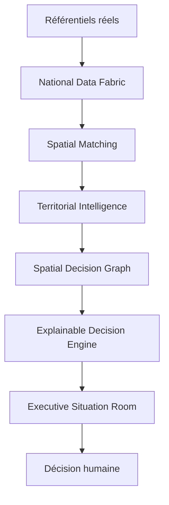

# LIVRE BLANC OFFICIEL

# SIG-FDSU RDC

## Plateforme nationale d’Intelligence Territoriale et d’Aide à la Décision

---

**Version :** 1.0 — brouillon institutionnel  
**Date :** 13 juillet 2026  
**Organisation :** Fonds de Développement du Service Universel — République Démocratique du Congo  
**Projet :** SIG-FDSU RDC  
**Auteurs :** Équipe projet SIG-FDSU RDC  
**Statut :** Soumis à validation institutionnelle  
**Classification :** Diffusion institutionnelle — brouillon de validation  

> Document de vision, de gouvernance et de référence. Il ne constitue ni une spécification technique, ni un manuel développeur, ni une décision d’investissement.

\newpage

## Préface

Le développement du Service Universel exige de transformer une grande diversité de faits territoriaux en décisions responsables : où investir, pour quels bénéficiaires, avec quels effets attendus, selon quelles preuves et dans quel ordre de priorité.

Le SIG-FDSU RDC a été conçu pour répondre à cette exigence. Il ne se réduit pas à la représentation de données sur une carte. Il établit un environnement national d’Intelligence Territoriale et d’Aide à la Décision où les référentiels, les analyses spatiales, les programmes et les recommandations peuvent être compris, vérifiés et mobilisés par les responsables publics.

Ce Livre Blanc décrit la raison d’être de cette plateforme, son modèle de valeur, ses principes de conception et son ambition institutionnelle. Il s’adresse à la Direction Générale, au Conseil d’Administration, aux directions métiers, aux partenaires techniques, aux bailleurs et aux équipes qui feront vivre la plateforme dans la durée.

## Remerciements

Le FDSU RDC reconnaît la contribution des directions métiers, des équipes de planification, d’ingénierie, de SIG, des agents de terrain, des administrateurs de données et des partenaires techniques. La valeur de la plateforme repose sur la coopération entre celles et ceux qui produisent les données, les qualifient, les interprètent et les transforment en décisions au service des populations.

## Historique des versions

| Version | Date | Nature | Statut |
|---|---|---|---|
| 1.0 | 2026-07-13 | Première édition institutionnelle | Brouillon de validation |

## Table des matières

1. [Le contexte national](#1-le-contexte-national)  
2. [Vision, mission et valeurs](#2-vision-mission-et-valeurs)  
3. [La philosophie du SIG](#3-la-philosophie-du-sig)  
4. [Architecture conceptuelle](#4-architecture-conceptuelle)  
5. [Le parcours décisionnel](#5-le-parcours-décisionnel)  
6. [Les modules et leur valeur métier](#6-les-modules-et-leur-valeur-métier)  
7. [Doctrine UX](#7-doctrine-ux)  
8. [Doctrine cartographique](#8-doctrine-cartographique)  
9. [Gouvernance](#9-gouvernance)  
10. [Roadmap et vision 2030](#10-roadmap-et-vision-2030)  
11. [Cas d’usage](#11-cas-dusage)  
12. [Annexes](#12-annexes)  

---

## Glossaire et sigles

| Terme | Définition institutionnelle |
|---|---|
| **CCN** | Centre Communautaire Numérique, capacité de service numérique communautaire. |
| **Data First** | Principe selon lequel toute donnée disponible dans un référentiel réel doit être exploitée avant toute approximation ou nouvelle duplication. |
| **Decision Intelligence** | Discipline qui transforme des données, règles, analyses et scénarios en information utile à la décision humaine. |
| **Explainability** | Capacité d’expliquer une donnée, un score, une relation ou une recommandation par des faits, sources, règles et limites. |
| **ESR** | Executive Situation Room, ou Salle de Pilotage de la Direction Générale. |
| **FDSU** | Fonds de Développement du Service Universel. |
| **NDF** | National Data Fabric : couche de gouvernance, de catalogue et d’interopérabilité des référentiels. |
| **NCI** | National Coverage Intelligence : capacité d’analyse de couverture nationale. |
| **NSME** | National Spatial Matching Engine : moteur de correspondance spatiale entre actifs, besoins et territoires. |
| **SDG** | Spatial Decision Graph : graphe qui expose les relations spatiales et leur contribution à une décision. |
| **TI** | Territorial Intelligence : lecture consolidée, multi-sectorielle et décisionnelle d’un territoire. |
| **TDT** | Territorial Digital Twin : dossier unifié d’une entité territoriale. |
| **Traçabilité** | Capacité à relier une information présentée à sa source, sa date, sa méthode et son usage. |

\newpage

# 1. Le contexte national

## 1.1 Le défi territorial du Service Universel

La République Démocratique du Congo présente une diversité géographique, démographique, institutionnelle et économique qui rend nécessaire une approche territoriale de la planification du Service Universel. Les besoins ne sont ni homogènes ni statiques. Ils dépendent de la population, de l’accessibilité, des infrastructures existantes, de la disponibilité des services publics, des contraintes de terrain, des programmes en cours et des priorités nationales.

Le défi n’est donc pas seulement de disposer de données. Il consiste à organiser des connaissances vérifiables afin de distinguer :

- les territoires où les besoins sont les plus significatifs ;
- les actifs et services déjà disponibles ;
- les contraintes d’accès, de raccordement ou de déploiement ;
- les lacunes de référentiel qui nécessitent une qualification complémentaire ;
- les investissements dont l’impact peut être démontré.

## 1.2 Pourquoi une plateforme nationale

Une plateforme nationale est nécessaire pour éviter que les décisions soient fondées sur des tableaux isolés, des cartes non reliées aux programmes ou des informations impossibles à vérifier. Elle doit permettre une lecture cohérente de la situation à plusieurs niveaux : national, provincial, territorial, local et site.

Le SIG-FDSU RDC soutient ainsi une continuité de décision : de l’observation nationale jusqu’au dossier d’investissement, de la donnée source jusqu’au suivi des effets.

## 1.3 Le rôle du FDSU

Le FDSU a besoin d’une capacité de pilotage qui relie l’objectif de Service Universel à une compréhension concrète des territoires. Cette capacité permet d’améliorer la priorisation, la justification des programmes, le dialogue avec les partenaires et la redevabilité à l’égard des populations bénéficiaires.

Ce Livre Blanc ne formule pas de diagnostic chiffré national. Les statistiques de référence doivent provenir des sources officielles validées au moment de chaque décision.

# 2. Vision, mission et valeurs

## 2.1 Vision stratégique

Le SIG-FDSU RDC est une plateforme nationale d’Intelligence Territoriale et d’Aide à la Décision. Elle permet de comprendre un territoire, identifier les besoins, expliquer les priorités, comparer des scénarios, simuler les investissements, justifier chaque décision et piloter les programmes FDSU.

La carte est un langage de décision. Elle rend visibles les faits, les relations, les contraintes et les conséquences ; elle n’est jamais une finalité autonome.

## 2.2 Mission

> Transformer des données multisectorielles en décisions territoriales explicables.

Cette mission implique que les données administratives, de population, de connectivité, de santé, de transport, de couverture et de programmes deviennent compréhensibles, localisables, comparables et actionnables.

## 2.3 Objectifs

1. Établir une source de lecture territoriale cohérente pour le FDSU.
2. Améliorer la qualité, la traçabilité et l’utilisation des référentiels.
3. Rendre les priorités et recommandations intelligibles.
4. Réduire les délais entre observation, analyse, arbitrage et suivi.
5. Renforcer le dialogue avec les directions métiers, partenaires et bailleurs.

## 2.4 Valeurs

| Valeur | Application attendue |
|---|---|
| Transparence | Les faits, limites et règles sont présentés au niveau approprié. |
| Traçabilité | Une information décisionnelle peut être reliée à sa source et à sa méthode. |
| Explicabilité | Une priorité ou recommandation répond au « pourquoi ». |
| Neutralité | L’incertitude est déclarée ; aucun résultat n’est maquillé. |
| Fiabilité | Les résultats sont vérifiés, cohérents et reproductibles. |
| Évolutivité | Les nouveaux référentiels s’intègrent sans créer de silos. |
| Interopérabilité | Les données sont gouvernées et composables à travers le NDF. |
| Qualité des données | Complétude, fraîcheur, cohérence et précision sont considérées. |
| Orientation décisionnelle | Chaque écran soutient une décision ou une action identifiable. |
| Simplicité d’utilisation | La complexité analytique ne doit pas devenir une charge pour l’utilisateur. |

# 3. La philosophie du SIG

## 3.1 Data First

Toute donnée disponible dans un référentiel réel doit être exploitée. Si un référentiel contient une information spatialement pertinente, l’interface ne peut l’afficher comme absente sans avoir effectué la recherche appropriée.

**Illustration :** un établissement de santé ou une infrastructure télécom déjà présent dans un référentiel doit alimenter l’analyse territoriale lorsqu’il est localisé dans le périmètre étudié. Une donnée existante mais non consommée est une anomalie d’intégration.

## 3.2 Explainability First

Chaque indicateur doit répondre aux questions suivantes : combien, lesquels, où, qui, pourquoi, quel impact et quelle recommandation.

**Illustration :** un décompte d’infrastructures télécom n’est utile que s’il peut être complété par les types d’actifs, les opérateurs, les localisations, les sources, les limites et l’action envisageable.

## 3.3 Decision First

Chaque écran est organisé autour d’une décision métier : arbitrer un investissement, préparer une mission, apprécier une couverture, comparer des territoires ou suivre un programme.

**Illustration :** un score de site doit conduire à une explication de ses facteurs, de ses lacunes et des suites possibles ; il ne doit pas être présenté comme une vérité autonome.

## 3.4 Spatial First

Toute donnée territoriale disposant d’une localisation fiable doit pouvoir être visualisée sur la carte. Le clic sur une information met en évidence les objets concernés ; le clic sur la carte ouvre le détail.

## 3.5 Evidence First

Une recommandation repose sur des faits observables, des sources, une méthode, un niveau de confiance et des limites déclarées. L’invention de scores, de distances, de relations ou d’impacts est interdite.

## 3.6 Integrity et Progressive Disclosure

Une capacité n’est terminée que lorsqu’elle est développée, branchée, alimentée, visible, testée et validée fonctionnellement. Elle révèle l’information par niveaux : synthèse, explication, analyse, détail et technique.

## 3.7 No Black Box et Human-Centered Decision Support

Le système assiste la décision humaine ; il ne la remplace pas. Aucun score, relation, simulation ou recommandation ne doit être impossible à expliquer. Les décideurs doivent pouvoir comprendre les preuves sans devoir lire les détails techniques, tandis que les experts doivent pouvoir y accéder.

## 3.8 Evolution by Design

La plateforme se construit par composition de capacités et de référentiels gouvernés. Les évolutions futures — énergie, éducation, comparaison, prédiction ou simulation — doivent enrichir ce cadre, non l’éviter.

# 4. Architecture conceptuelle

## 4.1 Le modèle d’intelligence



La version source du diagramme est disponible dans `diagrams/01_modele_intelligence.mmd`.

| Capacité | Contribution |
|---|---|
| Référentiels | Fournissent les faits de base sous gouvernance. |
| National Data Fabric | Catalogue, qualifie et relie les sources sans les dupliquer. |
| Spatial Matching | Établit des relations spatiales traçables entre actifs, besoins et territoires. |
| Territorial Intelligence | Compose une compréhension multi-sectorielle du territoire. |
| Spatial Decision Graph | Met en évidence les relations, impacts et lacunes. |
| Explainable Decision Engine | Prépare des recommandations justifiées et des dossiers décisionnels. |
| Executive Situation Room | Donne à la Direction Générale une lecture priorisée et pilotable. |

## 4.2 Les flux de valeur

Les flux sont fondés sur le principe de composition : les modules consomment des contrats et des données déjà gouvernés, au lieu de reconstruire leurs propres référentiels. La responsabilité finale de l’arbitrage reste humaine.

## 4.3 Sécurité, qualité et confiance

La qualité ne se limite pas à l’existence d’une valeur. Elle comprend la provenance, la cohérence, la fraîcheur, la précision géographique et la complétude. Une information partielle peut être utile, à condition que sa limite soit visible.

# 5. Le parcours décisionnel


| Étape | Question centrale | Capacités mobilisées |
|---|---|---|
| Observation | Que se passe-t-il ? | Cartographie, NDF, indicateurs |
| Compréhension | Qui et où sont les faits ? | TI, TDT, fiches |
| Analyse | Quels besoins, actifs et contraintes ? | NSME, TI, SDG |
| Explication | Pourquoi cette situation ? | EDE, sources, drill-down |
| Comparaison | Quelle option ou quel territoire ? | Centre de Décision, comparateurs futurs |
| Simulation | Que se passe-t-il si ? | Scénarios, hypothèses déclarées |
| Recommandation | Quelle action est justifiée ? | EDE, dossier de décision |
| Décision | Quel arbitrage est retenu ? | DG, Comité de Pilotage |
| Suivi | L’action avance-t-elle ? | ESR, programmes, KPI |
| Évaluation | Quel effet réel a été obtenu ? | Référentiels, terrain, audit |

# 6. Les modules et leur valeur métier

| Module | Objectif | Entrées | Sorties | Valeur métier |
|---|---|---|---|---|
| Cartographie | Voir le territoire et les objets | Couches géographiques et référentiels | Carte, filtres, fiches | Contexte spatial partagé |
| Territorial Intelligence | Comprendre une entité territoriale | Données sectorielles et profil partagé | Synthèse, indicateurs, recommandations | Priorisation territoriale |
| Territorial Digital Twin | Composer un dossier territorial | Identité, TI, NCI, transport, santé, programmes | Portrait unifié | Lecture cohérente d’un territoire |
| Decision Center / Workspace | Organiser l’analyse et l’arbitrage | KPI, détails, doctrines | Parcours de décision | Préparation des décisions |
| Spatial Decision Graph | Expliquer les relations spatiales | Besoins, actifs, règles spatiales | Nœuds, liens, impacts | Justification géographique |
| Explainable Decision Engine | Formaliser une recommandation | Doctrines, matrices, données sources | Dossier de décision | Traçabilité de la recommandation |
| Executive Situation Room | Piloter à l’échelle DG | Moteurs agrégés et alertes | Briefing, priorités, actions | Gouvernance exécutive |
| CCN et programmes | Suivre l’offre et les interventions | Programmes, sites, statuts | Portefeuille, fiches | Pilotage de mise en œuvre |
| National Data Fabric | Gouverner les sources | Métadonnées, qualité, relations | Catalogue et provenance | Interopérabilité durable |

# 7. Doctrine UX

## 7.1 Principes d’expérience

- Chaque KPI est cliquable lorsqu’un détail existe.
- Chaque KPI ouvre un drawer, panneau ou parcours de détail équivalent.
- Chaque drawer pilote la carte ; la carte pilote les fiches.
- Chaque fiche expose le rôle de l’objet dans une décision.
- Aucun bouton décoratif n’est autorisé.
- Aucune donnée métier n’est affichée sans contexte, source ou statut lorsque ces informations existent.

## 7.2 Niveaux d’explication

| Niveau | Public | Contenu |
|---|---|---|
| 1. Synthèse DG | Direction Générale | Situation, alerte, recommandation courte |
| 2. Explication métier | Directions et comité | Répartition, acteurs, impact, action |
| 3. Analyse territoriale | Planification, SIG, ingénierie | Relations, couverture, contraintes, comparaisons |
| 4. Exploration détaillée | Experts et terrain | Objets, attributs, localisation, statut |
| 5. Détail technique | Administration et audit | Sources, méthodes, règles, qualité, traces |

## 7.3 Direction Générale

Tout écran DG doit permettre de répondre en quelques instants : que se passe-t-il, pourquoi, où, quelles conséquences, que recommande le système et quelles preuves soutiennent la recommandation.

# 8. Doctrine cartographique

## 8.1 Règles

Les cartes disposent d’une légende interactive, de filtres, de couches synchronisées et de relations explicables. Une couche annoncée comme disponible doit être visible et exploitable dans l’application. Les emprises et redessins doivent correspondre aux objets réellement rendus.

## 8.2 Registre de symbologie institutionnel

| Domaine | Couleur de référence | Symbole | Rôle |
|---|---|---|---|
| Télécom | Bleu | Antenne / signal | Connectivité |
| Santé | Vert | Croix / établissement | Service sanitaire |
| Routes | Gris ardoise | Axe | Accessibilité |
| Fibre | Magenta | Nœud / ligne | Raccordement |
| CCN | Violet | Centre | Service numérique communautaire |
| Sites FDSU | Ambre | Balise | Intervention FDSU |
| Éducation | Bleu-vert | École | Service éducatif |
| Énergie | Jaune | Éclair | Ressource énergétique |
| Population | Indigo | Groupe | Bénéficiaires |
| Administratif | Jaune-or | Polygone | Cadre territorial |
| Marchés | Orange | Marché | Activité économique |
| Environnement | Vert foncé | Feuille | Contrainte ou opportunité |

La couleur ne porte pas seule la signification : elle est accompagnée d’un libellé, d’une légende et d’un état de maturité.

# 9. Gouvernance

## 9.1 Responsabilités

| Domaine | Responsable de gouvernance | Responsabilité |
|---|---|---|
| Vision et arbitrage | Direction Générale | Orientation, priorités et décisions |
| Portefeuille | Comité de Pilotage | Validation et suivi des initiatives |
| Référentiels métier | Directions compétentes | Qualité, mise à jour et signification métier |
| Géographie et méthodes | Experts SIG | Géométries, méthodes spatiales, cohérence des couches |
| Architecture et intégration | Équipe projet | Contrats, interopérabilité, conformité Data First |
| Exploitation | Administrateurs | Disponibilité, habilitations, sécurité et audit |
| Documentation | Propriétaires documentaires désignés | Versions, validation, diffusion et archivage |

## 9.2 Gestion des évolutions

Toute évolution doit identifier le besoin métier, les données déjà disponibles, la source de vérité, les impacts sur les capacités existantes, les critères de qualité et le plan de validation fonctionnelle.

Les documents de doctrine sont versionnés après validation institutionnelle. Les versions antérieures restent consultables pour préserver la traçabilité des décisions d’architecture.

## 9.3 No Black Box

Toute priorité, relation, score, simulation ou recommandation doit pouvoir être justifié par ses données, règles, hypothèses, limites et niveau de confiance. Le droit de comprendre accompagne le droit d’utiliser un résultat de décision.

# 10. Roadmap et vision 2030

## 10.1 Phases indicatives

| Phase | Objectif | Résultat attendu |
|---|---|---|
| Phase 1 — Fondations | Gouverner les référentiels et les parcours existants | Sources identifiées, Data First et intégrité consolidés |
| Phase 2 — Intégration territoriale | Étendre les domaines et le drill-down | Lecture multi-sectorielle fiable et spatialisée |
| Phase 3 — Décision avancée | Comparaison, scénarios et simulation | Arbitrages plus transparents et reproductibles |
| Vision 2030 | Référence nationale | Plateforme institutionnelle de planification, priorisation et pilotage |

Cette roadmap est une direction stratégique. Les échéances, budgets et jalons opérationnels relèvent de la gouvernance programme.

## 10.2 Capacités futures

- IA décisionnelle avec preuves et contrôle humain ;
- assistant conversationnel sourcé ;
- simulation budgétaire ;
- projection temporelle ;
- comparaison automatique de territoires ;
- optimisation territoriale sous contraintes ;
- analyse prédictive et vision prospective.

Ces capacités ne peuvent être considérées comme opérationnelles avant validation des données, des hypothèses, des règles et des impacts.

# 11. Cas d’usage institutionnels

## 11.1 Direction Générale : arbitrer une priorité

La Direction Générale consulte la situation nationale, identifie une alerte, ouvre la justification territoriale, examine les preuves et décide d’une orientation. La plateforme fournit le contexte ; la responsabilité de l’arbitrage demeure humaine.

## 11.2 Planification : comparer des territoires

La Direction Planification compare les besoins, la population, la couverture, les programmes et les contraintes de plusieurs territoires. Les écarts sont expliqués par les mêmes définitions et sources, afin d’éviter une comparaison de chiffres hétérogènes.

## 11.3 Ingénierie : apprécier la faisabilité

La Direction Ingénierie consulte les infrastructures, routes, nœuds et contraintes spatiales afin de qualifier les options de déploiement. Les données manquantes sont déclarées et peuvent conduire à une mission de qualification.

## 11.4 Terrain : préparer une mission

Un agent terrain consulte les objets à confirmer, leur emplacement, leur source et leur contexte. Le retour terrain contribue ensuite à améliorer la qualité du référentiel et des décisions ultérieures.

## 11.5 Bailleur : suivre l’impact

Un partenaire ou bailleur consulte les programmes, les indicateurs, les décisions associées, les limites de données et les résultats de suivi. La transparence facilite le dialogue sur les effets attendus et observés.

## 11.6 CCN : articuler connectivité et services

Le FDSU distingue l’infrastructure de connectivité et le service communautaire numérique. Un CCN est analysé avec son contexte territorial, son état, ses services, ses liens éventuels avec les sites et les besoins locaux.

# 12. Annexes

## Annexe A — Hiérarchie Data First

```text
Référentiel réel
        ↓
Calcul dérivé documenté
        ↓
Estimation explicite et sourcée
        ↓
En cours d’intégration
```

Un zéro n’est autorisé que lorsqu’un référentiel existe, qu’une recherche a été exécutée et que le résultat est réellement nul. Sinon, le système distingue notamment : non calculable, non renseigné, données insuffisantes, en cours d’intégration ou anomalie d’intégration.

## Annexe B — Checklist de qualité d’un sprint

- Données réelles exploitées ou absence réelle déclarée ;
- source, confiance et limites visibles ;
- KPI explicable ;
- carte synchronisée pour les données territoriales ;
- détail et drill-down lorsque les objets existent ;
- impact et recommandation justifiés lorsqu’ils sont annoncés ;
- traçabilité des règles et méthodes ;
- tests backend et E2E adaptés ;
- validation visuelle et validation métier.

## Annexe C — Correspondance avec la documentation de référence

| Référence | Apport au Livre Blanc |
|---|---|
| Architecture fonctionnelle | Délimitation des capacités de la plateforme |
| National Data Fabric | Gouvernance et interopérabilité des référentiels |
| Data First Policy | Règle d’exploitation des connaissances existantes |
| Integrity Gate | Critère de livraison fonctionnelle |
| Spatial Decision Graph | Explication des relations spatiales |
| Territorial Intelligence | Lecture multi-sectorielle des territoires |
| Territorial Digital Twin | Dossier unifié d’une entité |
| Explainable Decision Engine | Justification des recommandations |
| Executive Situation Room | Parcours de pilotage DG |

## Annexe D — Références

Voir `references/README.md` pour la méthode de citation, les références internes et la sélection de références externes à valider avant diffusion publique.

---

*Le présent Livre Blanc est soumis à validation institutionnelle. Il doit être enrichi par les contributions officielles des directions et partenaires avant toute publication externe.*
