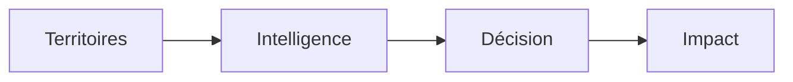

# SIG-FDSU RDC

## Présentation officielle de la plateforme

### Plateforme nationale d’Intelligence Territoriale et d’Aide à la Décision

---

**Organisation :** Fonds de Développement du Service Universel — République Démocratique du Congo  
**Projet :** SIG-FDSU RDC  
**Version :** 2.0 — design institutionnel, brouillon de validation  
**Date :** 13 juillet 2026  
**Destinataires :** Direction Générale · Conseil d’Administration · Ministère · partenaires institutionnels · bailleurs  
**Statut :** Soumis à validation institutionnelle  

<!--
COUVERTURE — À METTRE EN PAGE DANS WORD/PDF
Logo FDSU : [EMPLACEMENT RÉSERVÉ — haut gauche]
Fond : rendu validé de PRESENTATION_SIG_FDSU_RDC_ASSETS/cover/01_couverture_conceptuelle.mmd
Couleurs : Bleu institutionnel dominant, accent or, fond bleu nuit.
-->

> **Voir le territoire. Comprendre les besoins. Justifier les décisions.**



\newpage

## Comment lire cette présentation

Cette présentation est conçue comme un document exécutif : chaque séquence introduit une idée, une preuve visuelle et une conséquence stratégique.

Les diagrammes source, emplacements de captures, éléments de couverture et spécifications de mise en page sont disponibles dans `PRESENTATION_SIG_FDSU_RDC_ASSETS/`. Les captures définitives seront remplacées uniquement après validation fonctionnelle et institutionnelle.

## Le SIG-FDSU RDC en chiffres

Les chiffres ci-dessous proviennent des référentiels PostGIS consultés le 13 juillet 2026. Ils décrivent la disponibilité actuelle des objets dans les référentiels ; ils ne constituent pas, à eux seuls, une mesure de qualité ou de couverture.

| 26 | 145 | 733 | 1 681 |
|---:|---:|---:|---:|
| Provinces | Territoires | Collectivités | Groupements |

| 26 710 | 37 562 | 14 580 | 20 476 |
|---:|---:|---:|---:|
| Localités | Établissements de santé | Infrastructures télécom | Sites candidats du programme « 20 476 » |

**Sources :** `public.provinces`, `public.territoires`, `public.collectivites`, `public.groupements`, `public.localites`, `health.health_facilities`, `telecom.infrastructure` ; nomenclature du programme « 20 476 ».  
**Note :** les volumes et la qualité de chaque référentiel sont interprétés dans leur contexte ; ils ne sont pas assimilés à des données parfaitement exhaustives sans audit de qualité dédié.

\newpage

## Message d’introduction

Le développement du Service Universel exige plus que la disponibilité de cartes ou de tableaux. Il exige une compréhension partagée des territoires, des besoins des populations, des infrastructures existantes, des programmes en cours et des conséquences de chaque décision d’investissement.

Le SIG-FDSU RDC a été créé pour répondre à cette exigence. Il constitue une plateforme nationale d’Intelligence Territoriale et d’Aide à la Décision au service du Fonds de Développement du Service Universel.

Son ambition est simple : donner aux responsables publics les moyens de voir, comprendre, expliquer, prioriser et piloter les interventions du FDSU sur la base de données vérifiables.

> Le SIG-FDSU RDC n’est pas un logiciel de cartographie. C’est un environnement de décision territoriale.

\newpage

# 1. Le contexte national

## La fracture numérique et le défi territorial

La République Démocratique du Congo se caractérise par une diversité importante de territoires, de populations, de contextes d’accessibilité et de niveaux d’équipement. Les besoins en connectivité et en services numériques ne sont ni identiques, ni uniformément répartis.

La planification du Service Universel doit tenir compte, notamment :

- des zones et populations insuffisamment desservies ;
- des infrastructures télécom et des possibilités de raccordement ;
- de l’accessibilité par route et des contraintes logistiques ;
- des services publics essentiels, tels que la santé et l’éducation ;
- des cadres administratifs et des réalités locales ;
- des investissements déjà programmés ou réalisés.

Dans ce contexte, une décision ne peut pas reposer sur une information isolée. Elle doit s’appuyer sur une lecture territoriale complète, explicable et partageable.

## Le rôle du FDSU

Le FDSU a pour responsabilité de contribuer à l’accès universel aux services de communication et aux services numériques. Cette responsabilité implique de prioriser les investissements, de justifier les choix, de coordonner les programmes et d’en suivre les effets.

Le SIG-FDSU RDC fournit un cadre commun pour exercer cette responsabilité avec plus de visibilité, de traçabilité et de cohérence.

# 2. Pourquoi le SIG-FDSU RDC ?

Avant la plateforme, les informations utiles à la décision pouvaient être dispersées entre des référentiels, des fichiers, des rapports, des cartes et des échanges métiers. Même lorsqu’elles existaient, elles n’étaient pas toujours reliées dans un même parcours décisionnel.

Le SIG-FDSU RDC répond à cinq besoins fondamentaux :

| Besoin | Réponse de la plateforme |
|---|---|
| Comprendre le territoire | Une lecture unifiée des populations, services, infrastructures, programmes et contraintes |
| Identifier les besoins | Des analyses de couverture, d’accessibilité, de services et de priorités |
| Justifier les choix | Des recommandations accompagnées de sources, de règles et de limites |
| Coordonner les interventions | Une lecture partagée des programmes et des acteurs |
| Suivre l’impact | Des indicateurs et des parcours de pilotage orientés résultats |

La plateforme ne remplace pas l’expertise des décideurs. Elle améliore la qualité, la rapidité et la transparence des informations mises à leur disposition.

## SIG classique ou plateforme d’intelligence territoriale ?

| Approche SIG classique | SIG-FDSU RDC |
|---|---|
| Représente principalement des couches et objets | Relie données, territoires, besoins, programmes et décisions |
| Répond surtout à « où ? » | Répond à « où, pourquoi, pour qui, avec quel impact et quelle action ? » |
| Cartes et tableaux souvent séparés | Carte, indicateurs, détails et recommandations synchronisés |
| Analyse ponctuelle | Parcours continu : observation, analyse, décision, suivi |
| Données exploitées selon les écrans | Data First : les référentiels disponibles doivent être mobilisés |
| Résultat parfois difficile à justifier | No Black Box : priorité, relation et recommandation explicables |

> **Le SIG-FDSU RDC transforme la cartographie en capacité de gouvernance territoriale.**

\newpage

# 3. Vision de la plateforme

La vision du SIG-FDSU RDC est de devenir la plateforme nationale de référence pour :

- la planification territoriale ;
- la priorisation des investissements ;
- la justification des décisions ;
- le suivi des programmes ;
- l’évaluation des effets du Service Universel.

Cette vision repose sur une exigence : chaque décision doit mobiliser les connaissances disponibles, déclarer explicitement les connaissances manquantes et permettre de comprendre pourquoi une action est proposée.

# 4. Les grands objectifs

## Comprendre

Offrir une lecture claire des territoires : populations, localités, infrastructures, services publics, routes, programmes et contraintes.

## Prioriser

Permettre au FDSU d’identifier les zones, sites et interventions à examiner en priorité selon des critères explicables.

## Justifier

Relier chaque recommandation à des faits, à une méthode, à des sources et à un niveau de confiance.

## Coordonner

Donner aux directions métiers, à la planification, à l’ingénierie, aux experts SIG et aux partenaires un langage commun de décision.

## Piloter

Mettre à disposition de la Direction Générale une lecture synthétique des priorités, risques, programmes et actions à conduire.

\newpage

# 5. Les principaux modules

## Cartographie nationale

La cartographie nationale permet de visualiser les territoires, les infrastructures, les services, les programmes et les relations spatiales. Elle fournit un contexte commun à l’ensemble des analyses.

**Valeur décisionnelle :** situer les faits, comparer les zones et comprendre les contraintes géographiques.

## National Data Fabric

Le National Data Fabric organise les référentiels utiles à la plateforme. Il ne crée pas une base de données parallèle : il catalogue, qualifie et relie les sources existantes.

**Valeur décisionnelle :** savoir quelles données existent, qui en est responsable, quelle est leur qualité et comment elles peuvent être mobilisées.

## Territorial Intelligence

L’Intelligence Territoriale produit une lecture consolidée d’un territoire : population, couverture, santé, télécom, routes, programmes, structures administratives et besoins.

**Valeur décisionnelle :** comprendre rapidement la situation d’un territoire et identifier les interventions à approfondir.

## Spatial Decision Graph

Le Spatial Decision Graph rend visibles les relations entre besoins, actifs, services, territoires et priorités. Il ne montre pas seulement des lignes sur une carte : il explique les liens et leur impact.

**Valeur décisionnelle :** comprendre pourquoi une relation spatiale est importante pour une décision.

## Explainable Decision Engine

Le moteur de décision explicable transforme les données, doctrines et règles de priorité en recommandations justifiées et en dossiers de décision traçables.

**Valeur décisionnelle :** passer de l’information à une recommandation qui peut être comprise, discutée et auditée.

## Executive Situation Room

La Salle de Pilotage donne à la Direction Générale une lecture synthétique de la situation nationale, des alertes, des priorités, des scénarios et des actions possibles.

**Valeur décisionnelle :** faciliter le pilotage stratégique sans perdre l’accès aux preuves détaillées.

## Centre de Décision

Le Centre de Décision organise les parcours d’analyse, de priorisation et de consultation des dossiers. Il permet de naviguer de l’indicateur vers l’explication, la carte et la décision.

**Valeur décisionnelle :** préparer des arbitrages cohérents et documentés.

## Centres Communautaires Numériques

Le module CCN permet d’examiner les services numériques communautaires en lien avec leur territoire, leur état de préparation, les programmes associés et les besoins locaux.

**Valeur décisionnelle :** articuler connectivité, services numériques et impact pour les communautés.

## Programmes FDSU

Les programmes FDSU sont visualisés dans leur contexte territorial : sites, statuts, priorités, localités et relations avec les autres données disponibles.

**Valeur décisionnelle :** suivre le portefeuille d’interventions et orienter les décisions de déploiement.

# 6. Les principales innovations

## Data First

Toute donnée déjà disponible dans un référentiel doit être exploitée. Une donnée existante ne peut pas être masquée ou présentée comme absente sans vérification.

Lorsque le référentiel n’existe réellement pas, la plateforme l’indique clairement comme **En cours d’intégration**.

## Explainability First

Une donnée utile à la décision doit répondre à des questions simples :

- Combien ?
- Lesquels ?
- Où ?
- Qui ?
- Pourquoi est-ce important ?
- Quel impact ?
- Quelle action est recommandée ?

## Spatial First

Les données territoriales sont conçues pour être visibles sur la carte. Les interactions entre cartes, indicateurs, listes et fiches renforcent la compréhension de la situation.

## No Black Box

Le SIG-FDSU RDC ne doit produire aucune priorité ou recommandation incompréhensible. Les scores, relations, règles et limites doivent pouvoir être expliqués.

## Decision Intelligence

La plateforme organise les données pour soutenir la décision humaine. Elle n’automatise pas l’arbitrage politique ou stratégique ; elle rend les faits, options et conséquences plus accessibles.

\newpage

# 7. Les bénéfices selon les profils

| Profil | Bénéfice principal |
|---|---|
| Directeur Général | Une lecture rapide des priorités, recommandations, risques et preuves |
| Conseil d’Administration | Une vision structurée du portefeuille, des résultats et de la justification des investissements |
| Planification | Des comparaisons territoriales et des scénarios plus cohérents |
| Ingénierie | Une meilleure compréhension des infrastructures, accès et contraintes de déploiement |
| Experts SIG | Un cadre pour qualifier les géométries, relations et analyses spatiales |
| Agents terrain | Des objets à localiser, vérifier et enrichir dans leur contexte |
| Partenaires techniques | Un cadre interopérable, transparent et gouverné |
| Bailleurs | Une meilleure traçabilité entre besoins, interventions, décisions et résultats |

# 8. Une expérience conçue pour la décision

La plateforme applique un principe de lecture progressive :

```text
Synthèse
    ↓
Explication
    ↓
Analyse territoriale
    ↓
Liste détaillée
    ↓
Carte et fiche
    ↓
Détail technique
```

Un décideur peut ainsi comprendre une situation en quelques instants, puis approfondir si nécessaire sans être confronté d’emblée à la complexité technique.

Les indicateurs, cartes, drawers, listes et fiches sont conçus comme un seul parcours de compréhension. Une information affichée doit pouvoir être explorée ; une action proposée doit être réelle.

# 9. Perspectives d’évolution

Le SIG-FDSU RDC prépare un ensemble d’évolutions stratégiques :

- comparaison systématique de territoires et de scénarios ;
- simulation budgétaire et analyse de portefeuille ;
- projection temporelle des programmes et de la couverture ;
- assistant conversationnel capable de répondre à des questions sourcées ;
- optimisation territoriale sous contraintes ;
- analyse prédictive, sous réserve de données et méthodes validées ;
- extension progressive à de nouveaux référentiels sectoriels.

Ces perspectives ne sont pas présentées comme des capacités déjà acquises. Elles s’appuient sur les fondations de gouvernance, de données, d’explicabilité et de spatialisation mises en place par la plateforme.

# 10. Conclusion

Le SIG-FDSU RDC constitue une capacité stratégique pour le Fonds de Développement du Service Universel.

Il permet d’unifier la lecture des territoires, de rendre les programmes plus visibles, de mieux expliquer les priorités et de renforcer la justification des investissements. Il crée un langage commun entre la Direction Générale, les directions métiers, les experts, les partenaires et les bailleurs.

Son ambition est de devenir la plateforme nationale de référence pour la planification, la priorisation, la justification et le pilotage des investissements du Service Universel en République Démocratique du Congo.

> Une décision de qualité repose sur des faits fiables, des priorités explicables et une compréhension partagée du territoire.

---

## Storyboard de présentation PDF

La conversion institutionnelle peut organiser le document en séquences visuelles :

| Séquence | Idée à retenir | Élément visuel recommandé |
|---|---|---|
| Couverture | Le territoire devient intelligence et impact | Schéma de couverture conceptuelle |
| Contexte | Le Service Universel exige une lecture territoriale | Carte ou figure F-02 validée |
| En chiffres | La plateforme relie des référentiels nationaux significatifs | Page de chiffres clés |
| Différence | Le SIG-FDSU RDC va au-delà de la carte | Double page comparative |
| Capacités | Les modules forment une chaîne de valeur | Diagrammes NDF, TI, SDG, EDE et ESR |
| Décision | La plateforme rend la décision explicable | Flux décisionnel |
| Produits | Le lecteur peut voir la plateforme réelle | Figures 1 à 10 validées |
| Conclusion | L’investissement soutient une capacité nationale durable | Message institutionnel final |

Les sources Mermaid correspondantes sont disponibles dans `PRESENTATION_SIG_FDSU_RDC_ASSETS/diagrams/`.

## Espaces réservés aux captures réelles

| Figure | Écran réel à capturer | Légende de publication |
|---|---|---|
| Figure 1 | Cartographie nationale | Une vision commune des territoires, couches et programmes |
| Figure 2 | Territorial Intelligence — Dungu | Une lecture expliquée des réalités territoriales |
| Figure 3 | Analyse d’Impact Territorial | Relier besoin, actif, impact et action |
| Figure 4 | Spatial Decision Graph | Des relations spatiales qui éclairent les priorités |
| Figure 5 | Executive Situation Room | Une lecture de pilotage pour la Direction Générale |
| Figure 6 | Centre de Décision | Des preuves organisées pour l’arbitrage |
| Figure 7 | Référentiel Santé | Des services de santé rendus visibles et exploitables |
| Figure 8 | Référentiel Télécommunications | Des infrastructures et opérateurs dans leur contexte |
| Figure 9 | Programmes FDSU | Les interventions dans leur contexte territorial |
| Figure 10 | Analyse explicable d’un site | Une recommandation accompagnée de ses preuves |

Les captures définitives doivent provenir d’une version validée du logiciel. Les maquettes, interfaces fictives et images générées d’interface sont interdites. Les objectifs, routes, états attendus et règles de validation sont décrits dans `PRESENTATION_SIG_FDSU_RDC_ASSETS/figures/README.md`.

---

## Références de gouvernance

Cette présentation s’aligne sur les documents d’architecture et de doctrine du projet, notamment :

- Architecture Fonctionnelle SIG-FDSU RDC ;
- National Data Fabric ;
- Data First Integration Policy ;
- End-to-End Integrity Gate ;
- Territorial Intelligence ;
- Territorial Digital Twin ;
- Spatial Decision Graph ;
- Explainable Decision Engine ;
- Executive Situation Room ;
- Decision Intelligence Design Principles.

*Document soumis à validation institutionnelle avant toute publication définitive.*
